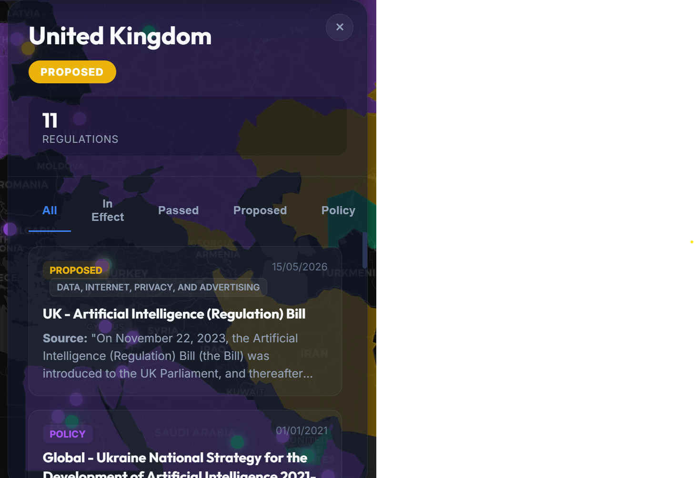

# Global AI Policy Tracker 🌍🤖

A comprehensive, real-time geographic visualization of global AI legislation, Lethal Autonomous Weapon Systems (LAWS) regulations, and sovereign algorithmic policies. Curated for the open-source community to provide maximum transparency on the statnation state to open a detailed dossier containing the laws, the dates they were proposed/enacted, and direct links to the official sources.
- **Search & Filter Engine:** Instantly search for nations or filter the map's state to only display specific regulatory statuses.
- **Premium UI:** Custom-built with advanced CSS glassmorphism and micro-animations, designed to be deeply immersive and highly responsive.

## 🛠️ Data Infrastructure

This tracker is powered by a custom Node.js data ingestion pipeline that normalizes data from multiple OSINT sources:
1. **Sovereign Dashboard Integration:** Ingests the `ai-regulations-local.json` dataset containing 450+ ultra-specific regulatory coordinates from the Sovereign Dashboard architecture.
2. **AI Policy Tracker Interfacing:** Scrapes and standardizes live JSON dumps from international policy aggregators.

### Data Update Protocol

To refresh the datasets and pull the latest global policies:
```bash
node scripts/data-ingest.js
```
This will automatically parse the remote and local JSON models, apply deduplication algorithms, and generate the static `unified-regulations.json` for the frontend.

## 💻 Local Development

The project is bundled via **Vite** for blazing fast HMR and optimized builds.

1. **Install Dependencies:**
   ```bash
   npm install
   ```

2. **Run Development Server:**
   ```bash
   npm run dev
   ```

3. **Build for Production:**
   ```bash
   npm run build
   ```
   *The built assets will be deployed to the `/dist` directory.*

## 🔗 Official Links
- **Creator:** [Avi Perera](https://aviperera.com)
- **Sovereign Dashboard:** [app.sovdash.com](https://app.sovdash.com)
- **GitHub Repository:** [Avi Perera / global-ai-policy-tracker](https://github.com/aviperera/global-ai-policy-tracker)

---
*Curated by Avi Perera. Built for transparency in Sovereign Algorithms and Autonomous Weapons Policy.*
